<!-- BANNER - profile.sh --live. Generated by scripts/banner.py from assets/source/me.png:
     the portrait morphs into Python / PyTorch / Hugging Face and back (~750 KB each). -->
<picture>
  <source media="(prefers-color-scheme: dark)"  srcset="assets/banner-dark.svg">
  <source media="(prefers-color-scheme: light)" srcset="assets/banner-light.svg">
  
</picture>

 

<!-- NAME / TAGLINE - animated typing -->

 

<!-- SOCIALS — LinkedIn stays brand blue (glyph vanishes on custom fills). Others themed. -->
&nbsp;&nbsp;
&nbsp;&nbsp;
&nbsp;&nbsp;

 

---

## This is me :)

Hi, I'm **Snehangshu**, data scientist and data analyst, broadcasting from India 🇮🇳.
I have an **M.Sc. in Statistics**, and I like taking the theory all the way to things
people can actually use: models on the Hub, apps analysts rely on, packages on PyPI.

- 💼 **Junior Software Developer at IDEAS-TIH, ISI Kolkata** (since Jun 2026), building an offline-first Flutter survey app. Before that I was a **Data Analyst Intern** there: 50,000+ record pipelines with **-60% manual QA** and ML modules for **XInsight**.
- 🧠 Deep into **LLM fine-tuning**: QLoRA, PEFT, TRL. I built GPT-2 from scratch and fine-tuned GPT-2 Medium, both live on Hugging Face.
- 🤖 Building **multi-agent RAG systems** with LangGraph and AutoGen, plus a T5-based code documentation generator.
- 📦 Author of **[sql-mcp-server](https://pypi.org/project/sql-mcp-server/)**, an open-source MCP server connecting Claude Desktop to SQL Server.
- 🎓 **B.Sc. + M.Sc. in Statistics** from Visva-Bharati University, Santiniketan.
- 💬 **Open to full-time Data Analyst / Data Scientist roles.** Talk to me about LLMs, RAG or messy survey data and you'll have my full attention.
 

## where I've worked

<!-- EXPERIENCE:START - generated by scripts/experience.py from assets/experience.json; edit that, not this -->
<picture>
  <source media="(prefers-color-scheme: dark)"  srcset="assets/experience-dark.svg">
  <source media="(prefers-color-scheme: light)" srcset="assets/experience-light.svg">
  
</picture>

<b>full details</b>

**Junior Software Developer (Project Linked)** · IDEAS – TIH, Indian Statistical Institute, Kolkata, West Bengal · *Jun 2026 – Present*

- Developed an offline-first Flutter application for airport passenger surveys with support for multiple survey schedules.
- Designed a dynamic survey workflow with conditional navigation, validation, and real-time expenditure calculations.
- Built a background sync engine to upload survey data automatically without interrupting field users.
- Implemented an in-app update system that polls the GitHub Releases API to detect new versions, then downloads and installs the APK directly, eliminating the need for Play Store distribution.
- Refactored the application into 40+ modular feature specifications, improving maintainability and development velocity.

**Data Analyst Intern** · IDEAS – TIH, Indian Statistical Institute, Kolkata, West Bengal · *Nov 2025 – Mar 2026*

- Built and maintained Python-based data processing pipelines handling 50,000+ records, reducing manual QA effort by 60% through automated validation and anomaly detection.
- Developed machine learning and AI-powered analytical modules for trend analysis, anomaly detection, and production-ready data applications within the XInsight platform.
- Integrated natural language query capabilities to enable conversational interaction with datasets for non-technical users.
- Collaborated with engineering teams to package and deploy applications using PyInstaller, improving software delivery and usability.

**Data Science Intern** · DataSpace Academy · *Oct 2025*

- Built an end-to-end customer churn prediction pipeline on 7,000+ telecom records using Logistic Regression and Random Forest with SMOTE class balancing, achieving 79.7% accuracy and identifying top five churn drivers.
- Delivered an executive-facing churn analysis report with correlation heatmaps and feature visualizations, translating model outputs into actionable retention strategies.

<!-- EXPERIENCE:END -->

---

## my perfect stack`

---

## signals

<table>
<tr>
<td width="50%" align="center" valign="middle">

<!-- Self-rated radar scope - edit assets/skills.json, the workflow redraws it -->
<picture>
  <source media="(prefers-color-scheme: dark)"  srcset="assets/radar-dark.svg">
  <source media="(prefers-color-scheme: light)" srcset="assets/radar-light.svg">
  
</picture>

</td>
<td width="50%" align="center" valign="middle">

<!-- Self-rated stack radar scope - edit assets/langmix.json -->
<picture>
  <source media="(prefers-color-scheme: dark)"  srcset="assets/radar-langs-dark.svg">
  <source media="(prefers-color-scheme: light)" srcset="assets/radar-langs-light.svg">
  
</picture>

</td>
</tr>
</table>

---

## things I've shipped

<!-- PROJECTS:START - generated by scripts/projects.py from assets/projects.json; edit that, not this -->
<table>
<tr>
<td width="50%" align="center" valign="top">
<a href="https://snehangshu511-gpt2-medium-instruct-demo.hf.space/"><picture>
  <source media="(prefers-color-scheme: dark)"  srcset="assets/projects/gpt2-medium-instruct-dark.svg">
  <source media="(prefers-color-scheme: light)" srcset="assets/projects/gpt2-medium-instruct-light.svg">
  
</picture></a>
<a href="https://snehangshu511-gpt2-medium-instruct-demo.hf.space/">Demo</a> · <a href="https://huggingface.co/snehangshu511/gpt2-medium-instruct">Model</a> · <a href="https://github.com/snehangshu2002/gpt2-instruct-finetune">Code</a>
</td>
<td width="50%" align="center" valign="top">
<a href="https://snehangshu511-tinystories-gpt2-demo.hf.space/"><picture>
  <source media="(prefers-color-scheme: dark)"  srcset="assets/projects/tinystories-gpt2-dark.svg">
  <source media="(prefers-color-scheme: light)" srcset="assets/projects/tinystories-gpt2-light.svg">
  
</picture></a>
<a href="https://snehangshu511-tinystories-gpt2-demo.hf.space/">Demo</a> · <a href="https://hf.co/snehangshu511/tinystories-gpt2-124M-scratch">Model</a> · <a href="https://github.com/snehangshu2002/tinystories-gpt2-from-scratch">Code</a>
</td>
</tr>
<tr>
<td width="50%" align="center" valign="top">
<a href="https://huggingface.co/snehangshu511/MedQA-TinyLlama-QLoRA-v3"><picture>
  <source media="(prefers-color-scheme: dark)"  srcset="assets/projects/medqa-tinyllama-dark.svg">
  <source media="(prefers-color-scheme: light)" srcset="assets/projects/medqa-tinyllama-light.svg">
  
</picture></a>
<a href="https://huggingface.co/snehangshu511/MedQA-TinyLlama-QLoRA-v3">Model</a> · 
</td>
<td width="50%" align="center" valign="top">
<a href="https://pypi.org/project/sql-mcp-server/"><picture>
  <source media="(prefers-color-scheme: dark)"  srcset="assets/projects/sql-mcp-server-dark.svg">
  <source media="(prefers-color-scheme: light)" srcset="assets/projects/sql-mcp-server-light.svg">
  
</picture></a>
<a href="https://pypi.org/project/sql-mcp-server/">PyPI</a> · <a href="https://github.com/snehangshu2002/sql-mcp-server">Code</a>
</td>
</tr>
<tr>
<td width="50%" align="center" valign="top">
<a href="https://github.com/snehangshu2002/saarthi-cli"><picture>
  <source media="(prefers-color-scheme: dark)"  srcset="assets/projects/saarthi-cli-dark.svg">
  <source media="(prefers-color-scheme: light)" srcset="assets/projects/saarthi-cli-light.svg">
  
</picture></a>
<a href="https://github.com/snehangshu2002/saarthi-cli">Code</a>
</td>
<td width="50%" align="center" valign="top">
<a href="https://github.com/snehangshu2002/aws-fraud-detection-sagemaker"><picture>
  <source media="(prefers-color-scheme: dark)"  srcset="assets/projects/aws-fraud-detection-dark.svg">
  <source media="(prefers-color-scheme: light)" srcset="assets/projects/aws-fraud-detection-light.svg">
  
</picture></a>
<a href="https://github.com/snehangshu2002/aws-fraud-detection-sagemaker">Code</a>
</td>
</tr>
<tr>
<td width="50%" align="center" valign="top">
<a href="https://github.com/snehangshu2002/airline-satisfaction-mlops"><picture>
  <source media="(prefers-color-scheme: dark)"  srcset="assets/projects/airline-satisfaction-mlops-dark.svg">
  <source media="(prefers-color-scheme: light)" srcset="assets/projects/airline-satisfaction-mlops-light.svg">
  
</picture></a>
<a href="https://github.com/snehangshu2002/airline-satisfaction-mlops">Code</a>
</td>
<td width="50%" align="center" valign="top">
<a href="https://github.com/snehangshu2002/predictive-maintenance-pytorch"><picture>
  <source media="(prefers-color-scheme: dark)"  srcset="assets/projects/predictive-maintenance-dark.svg">
  <source media="(prefers-color-scheme: light)" srcset="assets/projects/predictive-maintenance-light.svg">
  
</picture></a>
<a href="https://github.com/snehangshu2002/predictive-maintenance-pytorch">Code</a>
</td>
</tr>
</table>

<b>also shipped</b>

| Project | What it is | Links |
|:--|:--|:--|
| 📈 **Stock Prediction: LSTM vs GRU** | GRU wins with **R² 0.87** and 25% fewer params | [Code](https://github.com/snehangshu2002/stock-lstm-gru) |
| 🏷️ **NER: BiLSTM + Word2Vec** | 9-tag NER on CoNLL-2003 with a stacked BiLSTM tagger | [Code](https://github.com/snehangshu2002/deep-ner-stacked-bilstm) |
| 📞 **Customer Churn Prediction** | 7,000+ telecom records, LogReg + Random Forest with SMOTE: **79.7% accuracy** | [Code](https://github.com/snehangshu2002/Churn-Prediction-System) |
| 🤖 **Conversational RAG Chatbot** | Multi-PDF chat with history, FAISS + LLaMA-3.3-70B on Groq | [Code](https://github.com/snehangshu2002/Conversational-RAG-with-PDF-Chat-History) |
| 📄 **ATS Resume Optimizer** | n8n + Mistral: JD → tailored resume → scored PDF by email | [Code](https://github.com/snehangshu2002/ats-resume-enhancer) |
| 🍔 **AI Food Ordering Bot** | n8n + Telegram + Razorpay ordering with session memory | [Code](https://github.com/snehangshu2002/AI-Powered-Food-Ordering-Automation-System) |
| 💎 **RFM Customer Loyalty** | 9,994 transactions segmented into loyalty tiers | [Code](https://github.com/snehangshu2002/customer-loyalty-rfm) |
| 📉 **Superstore Sales Analysis** | Python + T-SQL window functions on discount-driven losses | [Code](https://github.com/snehangshu2002/Superstore-Sales-Analysis) |
| 🌐 **Portfolio Website** | React + Vite site with a scroll-scrubbed cinematic background | [Live](https://snehangshu2002.github.io/) · [Code](https://github.com/snehangshu2002/snehangshu2002.github.io) |

<!-- PROJECTS:END -->

📜 Certified: <a href="https://forage-uploads-prod.s3.amazonaws.com/completion-certificates/9PBTqmSxAf6zZTseP/io9DzWKe3PTsiS6GG_9PBTqmSxAf6zZTseP_k6g6cv8LxzapAyEdB_1750658504746_completion_certificate.pdf">Deloitte Data Analytics</a> · <a href="https://www.theforage.com/completion-certificates/tMjbs76F526fF5v3G/NjynCWzGSaWXQCxSX_tMjbs76F526fF5v3G_k6g6cv8LxzapAyEdB_1760341229900_completion_certificate.pdf">British Airways Data Science</a> · <a href="https://drive.google.com/file/d/1gKpt4Jj2LKN5X2iF4THYTr2kX-cGBP4q/view">DataSpace Academy</a>

---

## Numbers matter? ohhh yes.

<!-- stats.sh --watch dashboard, generated daily by scripts/cards.py into this repo, so the
     section doesn't go down when a shared public stats instance does. -->
<picture>
  <source media="(prefers-color-scheme: dark)"  srcset="assets/card-stats-dark.svg">
  <source media="(prefers-color-scheme: light)" srcset="assets/card-stats-light.svg">
  
</picture>

---

` Built with love · @snehangshu2002 `

