<!-- BANNER - profile.sh --live. Generated by scripts/banner.py from assets/source/me.png:
     the portrait morphs into Python / PyTorch / Hugging Face and back (~750 KB each). -->
<picture>
  <source media="(prefers-color-scheme: dark)"  srcset="assets/banner-dark.svg">
  <source media="(prefers-color-scheme: light)" srcset="assets/banner-light.svg">
  
</picture>

 

<!-- NAME / TAGLINE - animated typing -->

 

<!-- SOCIALS — LinkedIn stays brand blue (glyph vanishes on custom fills). Others themed. -->
&nbsp;&nbsp;
&nbsp;&nbsp;
&nbsp;&nbsp;

 

---

## This is me :)

Hi, I'm **Snehangshu**, data scientist and data analyst, broadcasting from India 🇮🇳.
I have an **M.Sc. in Statistics**, and I like taking the theory all the way to things
people can actually use: models on the Hub, apps analysts rely on, packages on PyPI.

- 📊 **Data Analyst Intern at IDEAS-TIH, ISI Kolkata** (Nov 2025 – Mar 2026): built a Python + DuckDB QA pipeline for 50,000+ PLFS records (**-60% manual QA**) and shipped **XInsight**, a Streamlit analytics app used by 10+ analysts.
- 🧠 Deep into **LLM fine-tuning**: QLoRA, PEFT, TRL. I built GPT-2 from scratch and fine-tuned GPT-2 Medium, both live on Hugging Face.
- 🤖 Building **multi-agent RAG systems** with LangGraph and AutoGen, plus a T5-based code documentation generator.
- 📦 Author of **[sql-mcp-server](https://pypi.org/project/sql-mcp-server/)**, an open-source MCP server connecting Claude Desktop to SQL Server.
- 🎓 **B.Sc. + M.Sc. in Statistics** from Visva-Bharati University, Santiniketan.
- 💬 **Open to full-time Data Analyst / Data Scientist roles.** Talk to me about LLMs, RAG or messy survey data and you'll have my full attention.
 

## my perfect stack`

---

## signals

<table>
<tr>
<td width="50%" align="center" valign="middle">

<!-- Self-rated radar - edit assets/skills.json, the workflow redraws it -->
<picture>
  <source media="(prefers-color-scheme: dark)"  srcset="assets/radar-dark.svg">
  <source media="(prefers-color-scheme: light)" srcset="assets/radar-light.svg">
  
</picture>

</td>
<td width="50%" align="center" valign="middle">

<!-- Self-rated language radar - edit assets/langmix.json -->
<picture>
  <source media="(prefers-color-scheme: dark)"  srcset="assets/radar-langs-dark.svg">
  <source media="(prefers-color-scheme: light)" srcset="assets/radar-langs-light.svg">
  
</picture>

</td>
</tr>
</table>

---

## things I've shipped

| Project | What it is | Links |
|:--|:--|:--|
| 🤖 **GPT-2 Medium Instruct (355M)** | GPT-2 Medium fine-tuned on Alpaca with a custom PyTorch architecture | [Model](https://huggingface.co/snehangshu511/gpt2-medium-instruct) · [Demo](https://snehangshu511-gpt2-medium-instruct-demo.hf.space/) · [Code](https://github.com/snehangshu2002/gpt2-instruct-finetune) |
| 🧱 **TinyStories GPT-2 (124M)** | Full GPT-2 decoder in raw PyTorch, trained from scratch, HF-compatible | [Model](https://hf.co/snehangshu511/tinystories-gpt2-124M-scratch) · [Demo](https://snehangshu511-tinystories-gpt2-demo.hf.space/) · [Code](https://github.com/snehangshu2002/tinystories-gpt2-from-scratch) |
| 🧬 **MedQA TinyLlama (QLoRA)** | TinyLlama-1.1B fine-tuned on 5k medical Q&A samples, 4-bit NF4 | [Model](https://huggingface.co/snehangshu511/MedQA-TinyLlama-QLoRA-v3) · [Colab](https://colab.research.google.com/drive/1kvrBhXElXRODwva8ntW-qsngi9Tpe_IW?usp=sharing) |
| 🔌 **sql-mcp-server** | MCP server for Claude Desktop ↔ SQL Server, with injection protection | [PyPI](https://pypi.org/project/sql-mcp-server/) · [Code](https://github.com/snehangshu2002/sql-mcp-server) |
| ⚙️ **Predictive Maintenance** | PyTorch + Optuna on AI4I 2020: **98% acc · 0.97 recall** | [Code](https://github.com/snehangshu2002/Predictive-Maintenance-PyTorch) |
| 📈 **Stock Prediction: LSTM vs GRU** | GRU wins with **R² 0.87** and 25% fewer params | [Code](https://github.com/snehangshu2002/stock-lstm-gru) |
| 🏷️ **NER: BiLSTM + Word2Vec** | 9-tag NER on CoNLL-2003 | [Code](https://github.com/snehangshu2002/NER-BiLSTM-Word2Vec) |
| 🤖 **Conversational RAG Chatbot** | Multi-PDF chat with history, FAISS + LLaMA-3.3-70B on Groq | [Code](https://github.com/snehangshu2002/Conversational-RAG-with-PDF-Chat-History) |
| 📄 **ATS Resume Optimizer** | n8n + Mistral: JD → tailored resume → scored PDF by email | [Code](https://github.com/snehangshu2002/ats-resume-enhancer) |
| 🍔 **AI Food Ordering Bot** | n8n + Telegram + Razorpay ordering with session memory | [Code](https://github.com/snehangshu2002/AI-Powered-Food-Ordering-Automation-System) |
| 💎 **RFM Customer Loyalty** | 9,994 transactions segmented into loyalty tiers | [Code](https://github.com/snehangshu2002/customer-loyalty-rfm) |
| 📉 **Superstore Sales Analysis** | Python + T-SQL window functions on discount-driven losses | [Code](https://github.com/snehangshu2002/Superstore-Sales-Analysis) |

📜 Certified: <a href="https://forage-uploads-prod.s3.amazonaws.com/completion-certificates/9PBTqmSxAf6zZTseP/io9DzWKe3PTsiS6GG_9PBTqmSxAf6zZTseP_k6g6cv8LxzapAyEdB_1750658504746_completion_certificate.pdf">Deloitte Data Analytics</a> · <a href="https://www.theforage.com/completion-certificates/tMjbs76F526fF5v3G/NjynCWzGSaWXQCxSX_tMjbs76F526fF5v3G_k6g6cv8LxzapAyEdB_1760341229900_completion_certificate.pdf">British Airways Data Science</a> · <a href="https://drive.google.com/file/d/1gKpt4Jj2LKN5X2iF4THYTr2kX-cGBP4q/view">DataSpace Academy</a>

---

## Numbers matter? ohhh yes.

<!-- Generated by scripts/cards.py into this repo, so the section doesn't go down
     when a shared public stats instance does. -->
<picture>
  <source media="(prefers-color-scheme: dark)"  srcset="assets/card-stats-dark.svg">
  <source media="(prefers-color-scheme: light)" srcset="assets/card-stats-light.svg">
  
</picture>

---

` Built with love · @snehangshu2002 `

